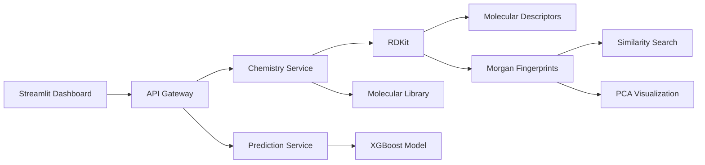

# Molecular Discovery Platform

A containerized, microservice-based platform for **cheminformatics, molecular exploration, and early-stage drug discovery workflows**. The platform combines **RDKit-based molecular analysis**, **chemical similarity search**, **chemical space visualization**, and **machine learning-based solubility prediction** behind a unified API Gateway and an interactive Streamlit dashboard. >

**Status:** MVP / actively developed

## Demo


The Streamlit dashboard provides a single interface for: 
- molecular analysis,
- molecular descriptor inspection,
- aqueous solubility prediction,
- structural similarity search,
- nearest-neighbour exploration,
- PCA-based chemical space visualization.

## Overview

The goal of this project is to build an extensible molecular discovery platform that connects **cheminformatics**, **machine learning**, and **production-oriented software engineering**.

A user provides a molecule represented as a **SMILES** string, and the platform can currently:

- calculate molecular descriptors,
- canonicalize SMILES,
- compare two molecular structures,
- search for structurally similar compounds,
- explore a molecular chemical space,
- predict aqueous solubility using a trained ML model,
- visualize results through an interactive web dashboard.

The system is designed as a set of **independent containerized services communicating through REST APIs**.

## Architecture

The application follows a microservice-based architecture in which individual components are responsible for separate parts of the molecular analysis workflow.



The API Gateway provides a unified interface while the underlying services remain modular and independently maintainable.

## Current Features
### Molecular descriptors

The Chemistry Service uses RDKit to calculate molecular properties from SMILES.

Currently supported descriptors: | Descriptor | Description | |---|---| | **Molecular Weight** | Molecular mass of the compound | | **LogP** | Estimated lipophilicity | | **TPSA** | Topological polar surface area | | **Hydrogen Bond Donors** | Number of hydrogen bond donor groups | | **Hydrogen Bond Acceptors** | Number of hydrogen bond acceptor groups | | **Rotatable Bonds** | Number of rotatable bonds | 

#### Example Request

```json { "smiles": "CCO" } ``` 

#### Example Response 

```json { "input_smiles": "CCO", "canonical_smiles": "CCO", "descriptors": { "molecular_weight": 46.069, "logp": -0.001, "tpsa": 20.23, "h_bond_donors": 1, "h_bond_acceptors": 1, "rotatable_bonds": 0 } } ```

### Molecular similarity

Molecular structures are represented using **Morgan fingerprints** generated with RDKit. Pairwise similarity is calculated using the **Tanimoto coefficient**. #### Pipeline

```text SMILES │ ▼ RDKit Molecule │ ▼ Morgan Fingerprint │ ▼ Tanimoto Similarity │ ▼ Similarity Score ```

Similarity scores range from `0.0` to `1.0`, where higher values indicate greater fingerprint similarity. Identical molecular fingerprints produce a similarity score of `1.0`.

### Chemical similarity search

The platform can search a molecular library and return the most structurally similar compounds to a query molecule.

The current compound library is based on the Delaney ESOL dataset.

#### Search workflow:

```text
Query SMILES
     ↓
Morgan fingerprint
     ↓
Compare against molecular library
     ↓
Bulk Tanimoto similarity
     ↓
Rank compounds
     ↓
Top-K nearest neighbours
```

#### Example request:

```json
{
  "smiles": "CC(=O)OC1=CC=CC=C1C(=O)O",
  "top_k": 5,
  "exclude_exact_match": true
}
```

### Returned results include:

- compound identifier,
- canonical SMILES,
- Tanimoto similarity,
- experimentally measured logS.
- Chemical space visualization

The `exclude_exact_match` option allows the query molecule itself to be omitted from the returned nearest neighbours.

#### The visualization contains:

- the molecular compound library,
- the query molecule,
- Top-K nearest neighbours determined independently using Tanimoto similarity.

#### Important distinction:

PCA coordinates are used only for visualization.
Nearest-neighbour ranking is calculated using Morgan fingerprints and Tanimoto similarity.

Therefore, geometric distance in the PCA projection should not be interpreted directly as Tanimoto similarity.

### Solubility prediction

The current machine learning model predicts aqueous solubility expressed as logS.

The model is trained on the Delaney ESOL dataset.

### Input features

The prediction model currently uses six RDKit descriptors:

| Feature | |---| | Molecular Weight | | LogP | | TPSA | | Hydrogen Bond Donors | | Hydrogen Bond Acceptors | | Rotatable Bonds |

#### Model:

`XGBRegressor`

#### Pipeline:

```text
SMILES
  ↓
Chemistry Service
  ↓
RDKit descriptors
  ↓
Prediction Service
  ↓
XGBoost
  ↓
Predicted logS
```

### Model Performance

Current evaluation uses a reproducible 80/20 random train-test split with:

```python
random_state = 42
```

#### Dataset size:

| Dataset | Number of Molecules | |---|---:| | Full dataset | 1,144 | | Training set | 915 | | Test set | 229 |

#### Test set:

229 molecules

### Results
| Model | MAE ↓ | RMSE ↓ | R² ↑ | |---|---:|---:|---:| | **XGBoost** | **0.4884** | **0.6524** | **0.9023** | | ESOL baseline | 0.6956 | 0.9077 | 0.8108 |

The current XGBoost model outperforms the dataset-provided ESOL baseline on the held-out random test split.

### Evaluation limitation

The current result should not be interpreted as evidence of equivalent performance on previously unseen molecular scaffolds.

Random molecular splits can place structurally related compounds in both training and test sets.

A scaffold-based split is therefore planned as a more chemically meaningful evaluation of model generalization.

## Project Goal

The long-term goal is to develop the project into an extensible experimentation and inference platform for computational drug discovery.

## Roadmap

Planned next steps focus on improving model validation, molecular analysis, and overall platform reliability.

### Near-Term

* [ ] Add RDKit 2D molecular structure rendering
* [ ] Implement Bemis-Murcko scaffold splitting
* [ ] Compare random split vs scaffold split
* [ ] Add prediction uncertainty or applicability-domain estimation
* [ ] Improve chemical-space visualization

### Future Extensions

* [ ] Add additional ADMET prediction tasks
* [ ] Compare descriptor-based and fingerprint-based models
* [ ] Add model versioning and experiment tracking
* [ ] Explore bioactivity prediction using curated public datasets

The roadmap prioritizes **scientific validation and model quality** before expanding the number of prediction tasks.

